# VINTED copy - Front-end

Project done while on BootCamp
Follow this link to see online ==>
https://vinted-reactjs.netlify.app/

## Description

A copy of the famous website Vinted.
This project contains

- Header on top of all routes with Burger Menu and options
- Landing Page displaying every Offers in database, with sorting parameters you can use in queries:
  - price_asc
  - price_desc
  - min and max price using Multi-Range Slider
  - title
- Register (allowing you to add an avatar picture) and Connexion Forms on modals
- Offer page, that you can access from Landing Page by clicking on an offer
- Publishing page, only accessible to connected users, allowing to add new offers with mutiple pictures
- Payment page, only accessible to connected users from an article page, using Stripe

All responsive.
Project is hosted on Netlify fot front-end, using back-end API from [Le-Reacteur](https://www.lereacteur.io/).
Personnal back-end is done and hosted on Northflank, available here ==>
https://github.com/Vincent-Saillard/Vinted-API

## Getting Started

If you want to test it on your local server, install needed dependencies and use "yarn dev" command.

### Dependencies

- react-js
- react-router-dom
- axios
- js-cookie
- @stripe/stripe-js
- @stripe/react-stripe-js
- multi-range-slider-react

### Functionalities

- BIG SCREENS

  - HOMEPAGE
    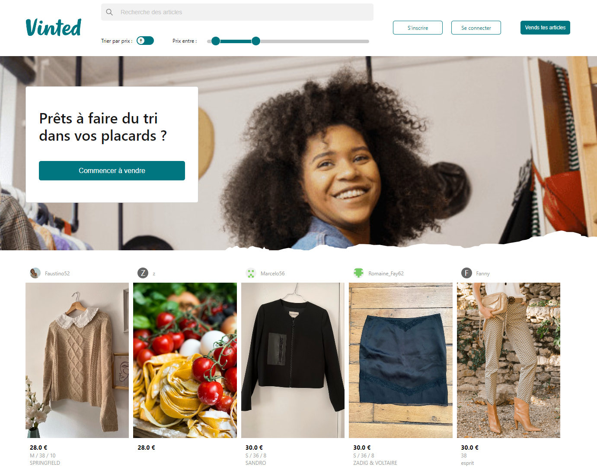
  - REGISTER MODAL
    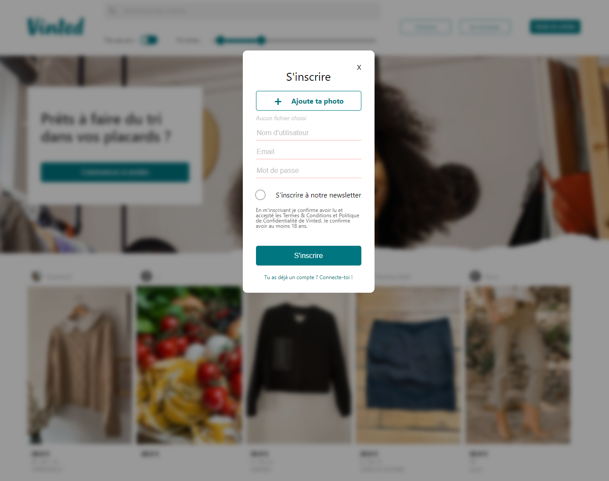
  - CONNECT MODAL
    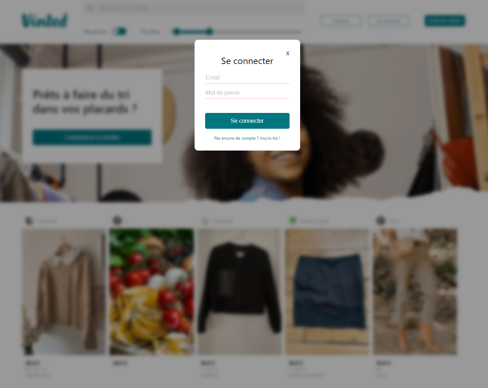
  - PUBLISH PAGE
    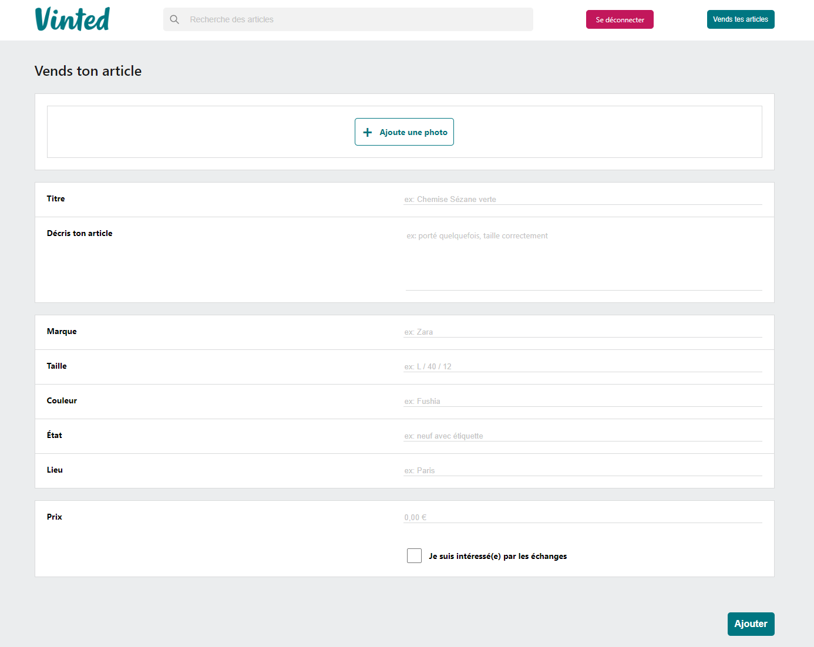
  - OFFER PAGE BY ID
    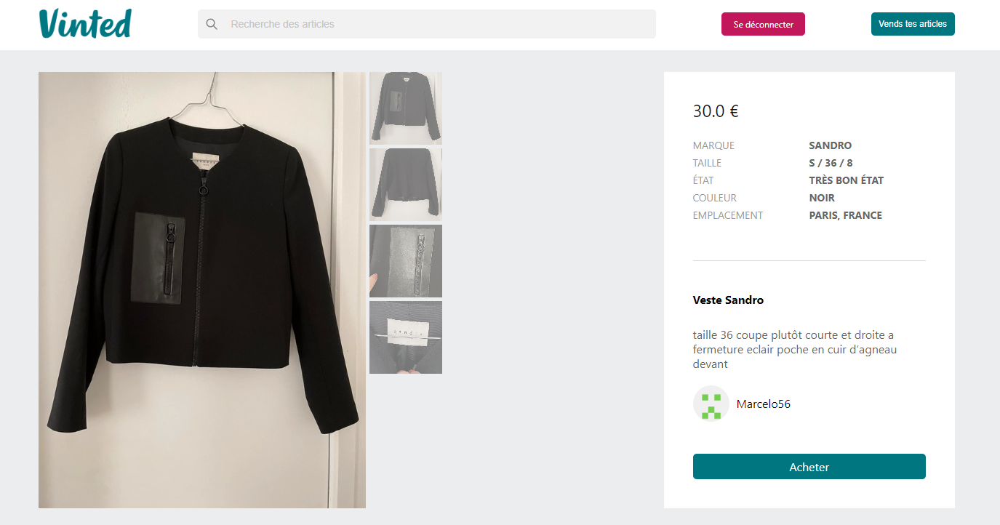
  - PAYMENT PAGE
    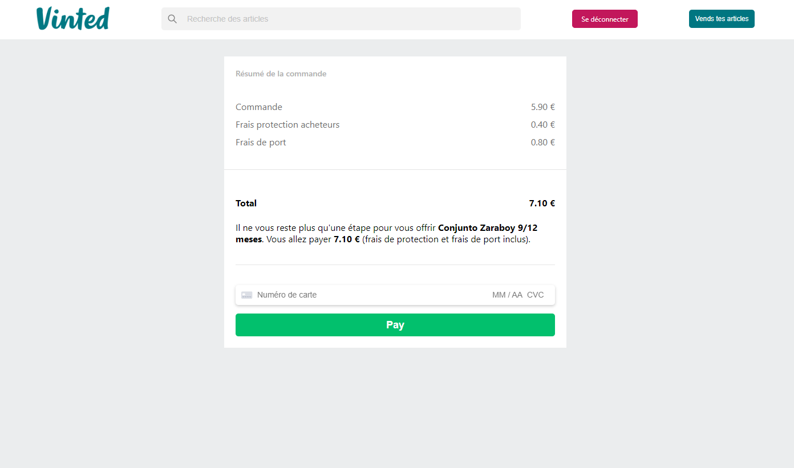

- SMALL SCREENS (example with Samsung Galaxy A51/71)
  - HOMEPAGE burger menu closed
    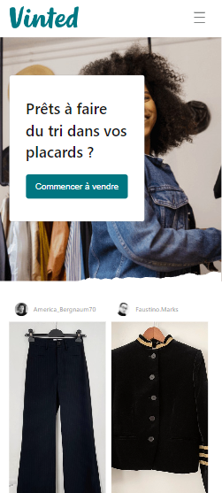
  - HOMEPAGE burger menu opened
    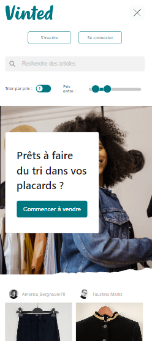
  - REGISTER MODAL
    
  - CONNECT MODAL
    
  - PUBLISH PAGE
    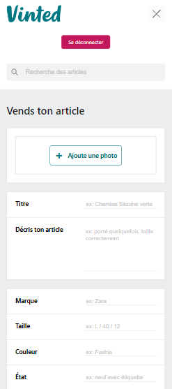
  - OFFER PAGE BY ID
    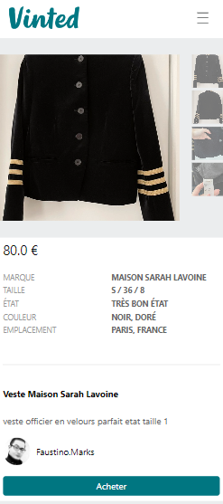
  - PAYMENT PAGE
    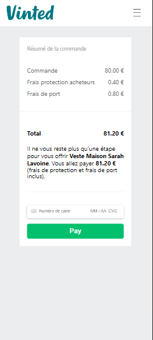

## Authors

Vincent Saillard

- https://www.linkedin.com/in/vincent-saillard-096255a7/
- https://github.com/Vincent-Saillard
  Le Reacteur
- https://www.lereacteur.io/

## Acknowledgments

Inspiration, code snippets, etc.

- [Multi-Range-Slider-React](https://github.com/developergovindgupta/multi-range-slider-react-ts)
- [Loading-Circle-CSS](https://loading.io/css/)
- [Vinted](https://www.vinted.fr/)
